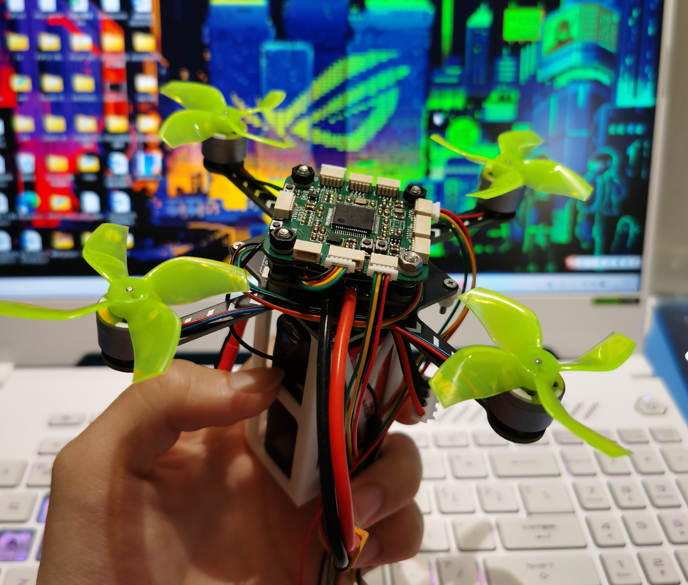
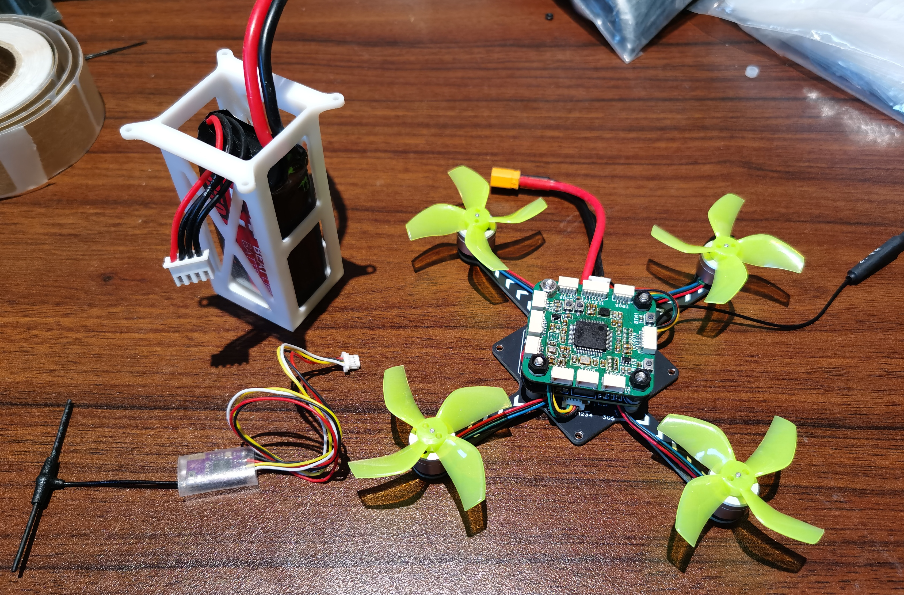
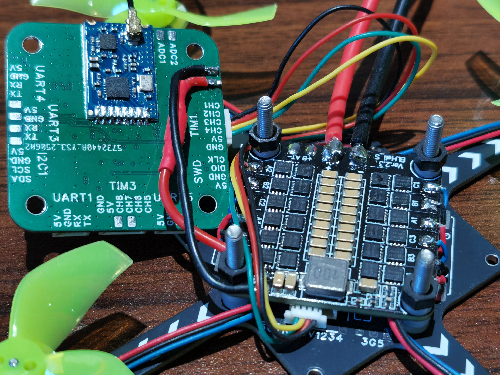
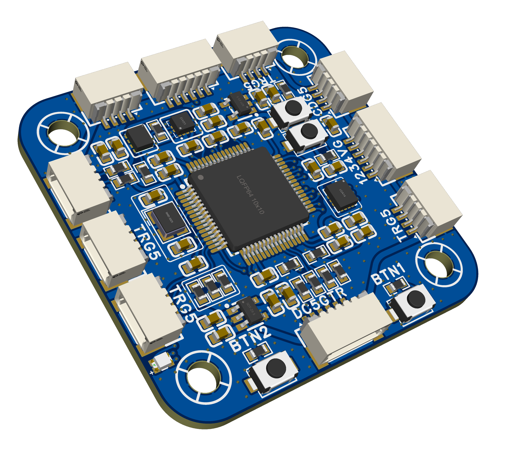
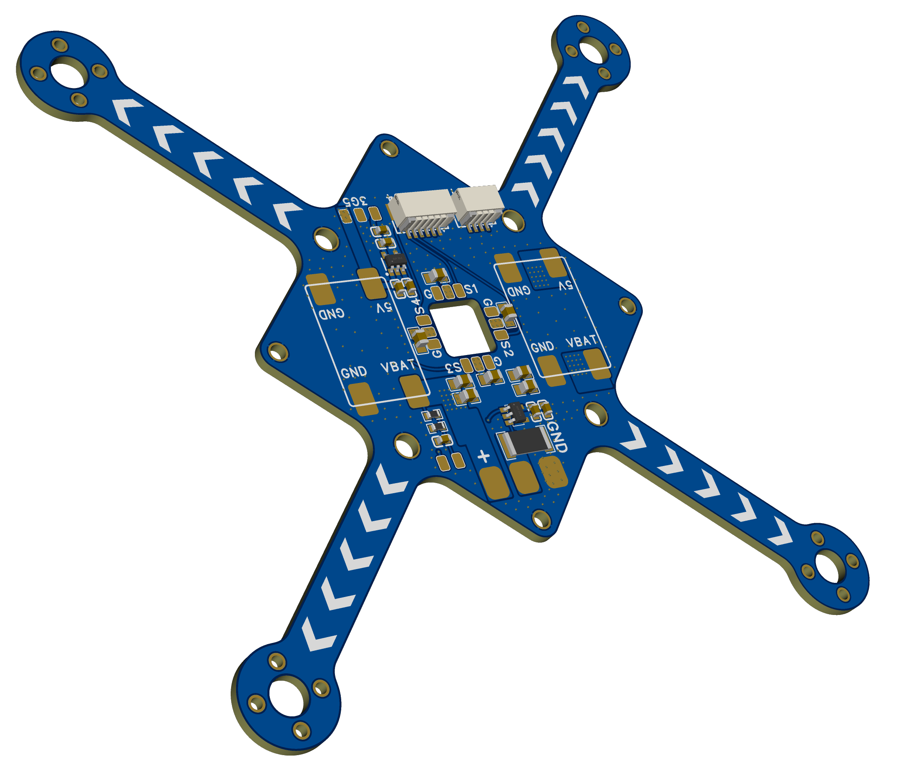

## 轻量级四旋翼算法开发框架

### Software

- DCM姿态解算
- simple math几何运算库
- SO3姿态控制器
- DSHOT输出
- CRSF解析
- 电机动力分配
- 巴特沃斯滤波器
- SI24R1无线调试驱动
- ICM42688-P QMC5883L SPL06驱动

### Hardware

- 1104无刷电机
- Gemfan乾丰 2020 4叶正反螺旋桨
- 30.5mm孔距30A四合一电调
- ELRS接收机
- 3S 850mAh 75C 电池 尺寸参考: 21mmx29mmx62mm
- UNIFC-F405飞控(自制)  支持其他30.5mm孔距飞控

飞行器起飞质量153.4g

### UNIFC-F405

含PCB工程文件、原理图、Gerber等

### 无线调参

STM32G030F6P6 无线调参模块，含有工程源码。

### PCB基板

含有电池电压电流测量等基本硬件，可焊接5V DCDC降压模块，用于驱动飞控或者舵机等