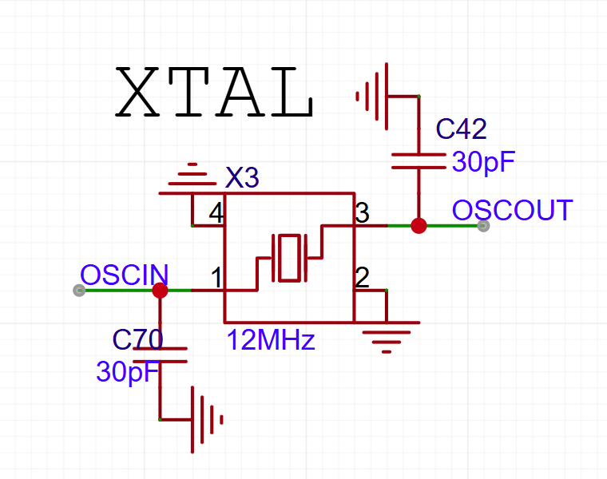

## 硬件架构：
### 主控板
主控：F405RGT6
陀螺仪：ICM-42688-P
气压计：SPL06
### 电源板
#### 设计思想
11.7V->5V在电源板上完成
5v->3.3v只需要在需要的期间上引出3V3给LDO的OUT就行
电源板还需要完成：
9路舵机供电
两个点火端口
### 信号板
放置GPS和接收机

## 设计目标
1. 正常计算姿态
2. 存储数据
3. 控制点火，开伞和舵机
### 拓展设计目标
1. 数据回传
2. 上位机通信

### 电路电子设计笔记
#### 晶振
公式：$CL(\text{负载电容})=\frac{Cd\times Cg}{Cd+Cg}$
> Cd和Cg位连接在晶振旁边的电容

#### IIC引脚上拉

IIC引脚是开漏输出，需要连接上拉电阻，通常是4.7K$\Omega$

#### IIC
飞控分配了两路总线的IIC,一路是气压计，另外一路是GPS

#### todo
1. GPS线序检查
2. 去掉si24r1模块，替换为USB
   - 使用Typec后，TIM1的CH4通道被占用，想要获得高质量的PWM，需要从TIM8中获取
   - 目前设定的PWM端口：TIM1：1~3,TIM2：1~2,TIM3：1~4

3. 增加黑匣子
4. 数传通信还没有想好具体的方案

